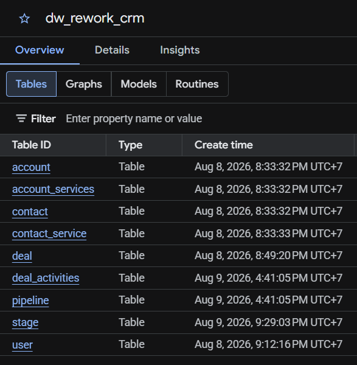
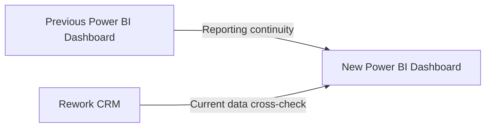
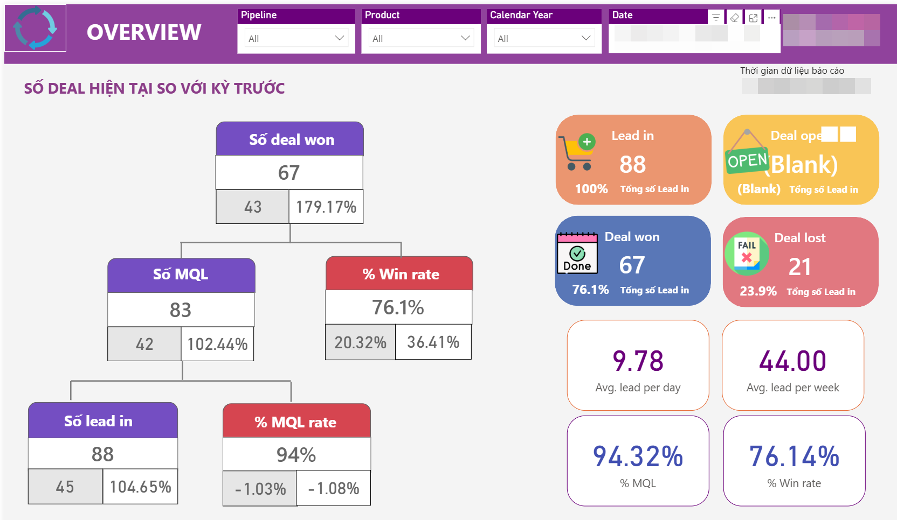
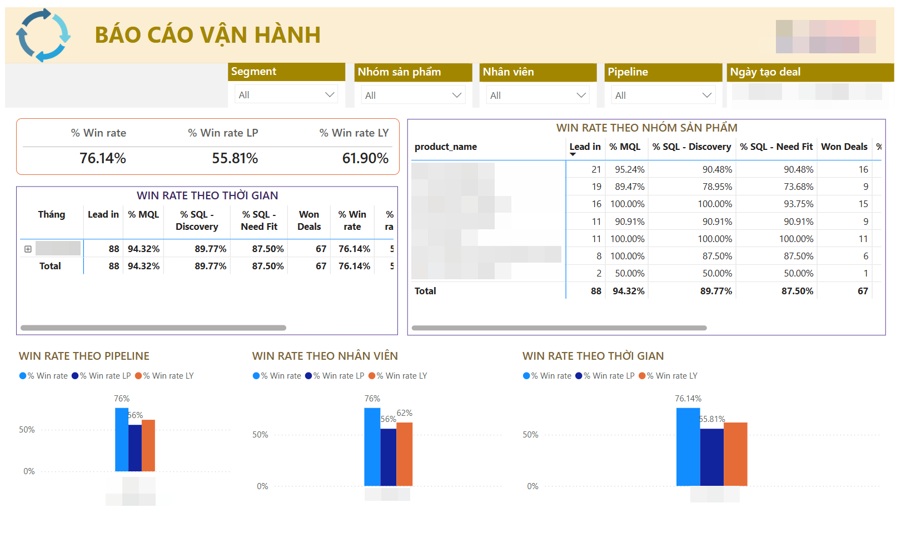
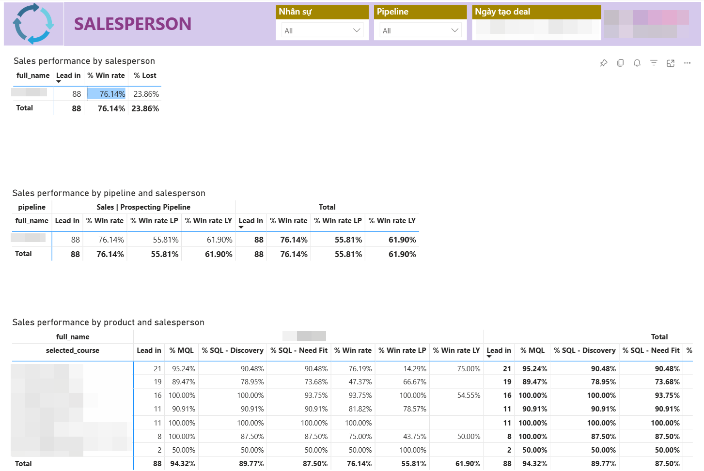
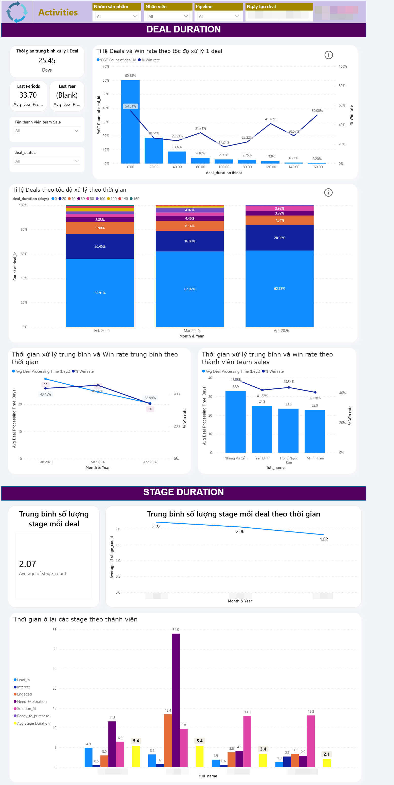

[Tiếng Việt](README.vi.md)

# CRM Data System Rebuild: From Pipedrive to Rework CRM

## Background

The company migrated its CRM from **Pipedrive to Rework CRM**.

The existing Data Warehouse had been built around Pipedrive's data structure, so the data pipeline could no longer support Sales reporting after the migration.

At the same time, historical Pipedrive data needed to be preserved so key Sales metrics such as **pipeline performance, deal stages, win rate, and lost reasons** could continue to be tracked consistently.

**Goal:** Rebuild the data pipeline and analytical model for Rework CRM while preserving historical Pipedrive data and maintaining reporting continuity.

---

## Architecture

```text
Rework CRM API
      │
      ▼
Airbyte (self-hosted)
Ingestion + Incremental Sync
      │
      ▼
BigQuery
Raw Data Layer
      │
      ▼
Dataform
Staging + Transformation
      │
      ▼
BigQuery Data Mart
Fact + Dimension Tables
      │
      ▼
Power BI
Sales Management & Monitoring
```

---

## Data Model

The Data Mart follows a **Snowflake Schema** designed around Deals and Deal Activities, with supporting dimensions for Contacts, Accounts, Pipelines, Stages, and Users.


### Main Tables

- `fact_deal` — one row per deal
- `fact_deal_activity` — one row per deal activity
- `dim_contact` — Contact dimension with SCD Type 2 for selected attributes
- `dim_account` — Account/company information
- `dim_pipeline` — Sales pipeline information
- `dim_stage` — Sales stage information
- `dim_user` — Sales owner/user information

---

# Implementation

## 1. Understanding the Data & Migration

Before rebuilding the pipeline, the main CRM entities and historical data were reviewed to understand how the new Rework structure differed from Pipedrive.

Historical Pipedrive records had previously been exported, field-mapped, and imported into Rework CRM.

Not every field could be mapped directly. Some original Pipedrive values were stored in Rework custom fields, while some standard Rework fields represented the migration event rather than the original business event.

Understanding these differences was important before deciding which fields should be used in the analytical layer.

→ [View Project Requirements](./docs/project-requirements.md)

---

## 2. Exploring & Testing the API

The main Rework CRM API endpoints were reviewed using the [Rework CRM API Documentation](https://rework-standard.apidocs.rework.site/home) and tested in **Postman** before building the ingestion pipeline.

The testing focused on:

- Authentication
- Response structure
- Pagination
- Nested data
- Relationships between endpoints

The main entities included **Deal, Contact, Account, Pipeline, Stage, and Deal Activity**.

This step helped determine how each entity should be extracted and how the streams needed to relate to each other in Airbyte.

---

## 3. Building the Ingestion Pipeline

I used **Airbyte self-hosted** and its Low-code Connector Builder to ingest Rework CRM data into BigQuery.

Several parts required custom configuration.

### Authentication

The API sends credentials through the **request body** instead of the request header.

### Pagination

The API uses `page / limit` pagination, which had to be configured manually in the connector.

### Parent-Child Streams

Deal activities cannot be retrieved through a single bulk endpoint.

The pipeline therefore retrieves deals first and then requests activities for each deal:

```text
Deals → Deal IDs → Activities for each Deal
```

### Incremental Sync

The main CRM entities contain approximately **25,000 deals and 25,000 contacts**.

Incremental Sync was configured so each run retrieves only new or updated records instead of reloading the entire dataset.

→ [View Airbyte Connector](./airbyte-custom-connector/)

---

## 4. Loading Raw Data into BigQuery

Airbyte loads the extracted CRM data into a **BigQuery raw layer** before business transformations are applied.

The raw layer preserves the source structure, including nested JSON, dynamic custom fields, and multiple extracted versions of CRM records.

Keeping the raw layer separate also makes it easier to trace transformed values back to the source when investigating data issues.



---

## 5. Cleaning & Transforming the Data

After the raw data was loaded into BigQuery, **Dataform** was used to build the staging layer and transform the CRM data into analytics-ready tables.

The Dataform project is organized into:

`declarations → staging → marts`

### Custom & Nested Fields

Rework stores many custom fields inside dynamic JSON arrays.

These fields are extracted with `UNNEST` and pivoted into analytical columns using `MAX(IF(...))`.

```text
JSON Array → UNNEST → Key / Value → Pivot → Analytical Columns
```

Other transformations include:

- Parsing nested JSON fields
- Decoding HTML and Base64 values
- Standardizing CRM statuses
- Mapping lost-reason identifiers to readable categories
- Removing duplicate source versions with `QUALIFY ROW_NUMBER()`

### Historical Pipedrive Data

Migrated records required additional handling because some Rework fields no longer represented the original business event.

For example, `created_at` in Rework could represent **when a historical deal was imported**, rather than when the deal was originally created in Pipedrive.

The transformation therefore prioritizes the original Pipedrive value when available:

```sql
COALESCE(
    pipedrive_created_at,
    rework_created_at
)
```

Similar fallback logic is applied to other historical fields where necessary, including deal close dates and migrated lost-reason information.

This prevents the CRM migration itself from distorting historical Sales reporting.

→ [View Dataform Models](./dataform/)

---

## 6. Building the Data Mart

The cleaned staging data is transformed into fact and dimension tables for analysis.

The model follows a **Snowflake Schema** centered around Deals and Deal Activities.

One modeling challenge involved Contact attributes such as **job title and location**, which can change over time.

`dim_contact` therefore uses **Slowly Changing Dimension Type 2 (SCD2)** to preserve historical versions of these attributes.

This allows a historical deal to remain associated with the Contact information that was valid when the deal was created, rather than always using the Contact's current information.

→ [View Data Dictionary](./docs/data-dictionary.md)

---

## 7. Reporting with Power BI

The Data Mart is used as the source for the Sales Pipeline dashboard in **Power BI**.

Sales representatives primarily use Rework CRM to manage individual deals, while Power BI provides **Sales Manager and Sales Admin with a management-level view of the team**.

The reporting layer supports monitoring of:

- Sales pipeline performance
- Deal stages
- Win / loss performance
- Lost reasons
- Sales activities
- Team performance
- Warning signals requiring attention

→ [View Dashboard](./sales_dashboard/)

---

## Testing & Validation

The rebuilt dashboard was validated from two directions:



### Previous Dashboard Reconciliation

Equivalent reporting periods and filters were applied to the previous and rebuilt dashboards.

Key metrics such as **deal count, deal stage, won/lost deals, win rate, lost reasons, and team performance** were compared to check reporting continuity after the CRM migration.

### Rework CRM Cross-check

For current data, equivalent filters were applied directly in Rework CRM and Power BI.

This was used to verify that dashboard results reflected the operational CRM correctly.

Migrated records were also checked separately where Rework timestamps could represent the migration date instead of the original business date.

→ [View Testing & Validation](./docs/testing-validation.md)

---

## Skills & Tools

| Area | Skills & Tools |
|---|---|
| **API** | REST API, Postman, pagination, parent-child streams |
| **Data Ingestion** | Airbyte, Low-code Connector Builder, Incremental Sync |
| **Data Warehouse** | BigQuery |
| **SQL** | `JSON_VALUE`, `UNNEST`, `QUALIFY ROW_NUMBER()`, window functions |
| **Transformation** | Dataform, staging & mart layers |
| **Data Modeling** | Snowflake Schema, Fact & Dimension tables, SCD Type 2 |
| **BI** | Power BI, Sales Pipeline reporting |

---

## Results

The rebuilt pipeline restored the data flow from **Rework CRM to the Data Warehouse and Power BI** after the CRM migration.

Historical Pipedrive data was preserved so migration-specific timestamps and field differences did not distort historical reporting.

As a result, **Sales Manager and Sales Admin can continue monitoring team-level Sales performance, pipeline health, and warning signals through Power BI**, while Sales representatives continue using Rework CRM for day-to-day operations.









> **Note:** Dự án này được xây dựng dựa trên dữ liệu thực tế của doanh nghiệp. Để đảm bảo tính bảo mật, các thông tin nhạy cảm trên dashboard đã được làm mờ hoặc ẩn; các key, credentials và giá trị bảo mật cũng đã được loại bỏ khỏi code và các file được chia sẻ trong repository.

---

## Repository Structure

```text
crm-data-warehouse/
│
├── docs/
│   ├── project-requirements.md   # Requirements, scope & execution plan
│   ├── data-dictionary.md        # Data model & field definitions
│   └── testing-validation.md     # Reporting validation
│
├── airbyte-custom-connector/     # Rework CRM API ingestion
├── dataform/                     # Transformation & Data Mart
├── sales_dashboard/              # Power BI reporting
└── assets/                       # ERD & screenshots
```

---

> **Note:** This project was built using real company data. To protect confidentiality, sensitive information shown in dashboards has been blurred or redacted, while confidential values, keys, and credentials have been removed from the code and files shared in this repository.
