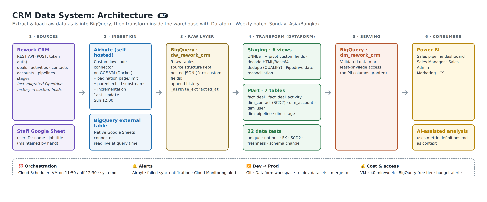

# CRM Data System: From Scattered CRM Data to a Trusted Sales Dashboard

> An end-to-end data system (**Airbyte → BigQuery → Dataform → Power BI**) built on real company data after a CRM migration (Pipedrive → Rework CRM). It covers API ingestion, historical reconciliation, dimensional modeling, automated data tests, scheduled runs with alerts, and one shared set of metric definitions.



---

## The problem

The company migrated its CRM from **Pipedrive to Rework CRM**. After that:

- The old warehouse was built around Pipedrive's structure, so **Sales reporting stopped working**.
- Getting a number meant **exporting and combining data by hand**.
- **Teams reported different numbers** for the same metric. The migration had rewritten dates, win rate was calculated in different ways, and test deals were mixed with real ones.

**Goal:** one system that brings CRM data into one place, cleans it, tests it, refreshes it on a schedule, and defines every metric once, while **preserving Pipedrive history**.

---

## Business questions this system answers

| # | Question | Answer |
|---|---|---|
| 1 | **Where do the enrolment/revenue numbers come from, and why did sources disagree?** | One source of truth: Rework CRM API → `fact_deal`. Three root causes of the mismatch were found and fixed. **(a)** Rework stamped every migrated record with the **migration date**, so years of history collapsed into the migration period; `COALESCE(pipedrive_created_at, rework_created_at)` restores the real dates. **(b)** Teams used different win-rate formulas (`won/total` vs `won/(won+lost)`); now there is one definition in [metric-definitions.md](docs/metric-definitions.md). **(c)** Internal test deals and duplicate labels (e.g. `fanpage` vs `fanpage_tm`) are now flagged and merged |
| 2 | **How far behind reality is the dashboard?** | Weekly batch: data is extracted Sunday 12:00 and the mart is rebuilt at 14:00, so **max latency ≈ 7 days + 2 h**, which suits the weekly Sales review. Staleness is **tested**: `assert_source_freshness` fails the run if raw data is older than 8 days. Measured by [`pipeline_run_history.sql`](orchestration/sql/pipeline_run_history.sql) |
| 3 | **When a dashboard number is wrong, how long does it take to trace it to the source?** | Every metric lists its source tables ([metric-definitions](docs/metric-definitions.md)). Dataform's dependency graph links mart → staging → raw, and each raw row keeps `_airbyte_extracted_at`. The path is always: metric definition → mart table → staging model → raw row, with no manual export needed |
| 4 | **What does the warehouse cost per month, and is it over budget?** | The VM runs **~40 min/week** instead of 24/7, and BigQuery usage fits the free tier. Tracked with [`cost_monitoring.sql`](orchestration/sql/cost_monitoring.sql) plus a GCP budget alert. See [Case study in numbers](#case-study-in-numbers) |
| 5 | **When the source changes structure, does the pipeline break, and how fast do we know?** | New CRM fields live inside a JSON array, so **nothing breaks**, and `assert_new_custom_fields` flags them **on the next run**. A removed or renamed column fails the Dataform run and triggers an alert **on the same Sunday run**, while the dashboard keeps the last good data. Details: [ingestion/README](ingestion/README.md#schema-change-handling) |

---

## Architecture decisions

| Decision | Choice | Why |
|---|---|---|
| **Warehouse** | **BigQuery** | Already in the company's Google Cloud stack, so no new vendor or contract. It is also a good fit on its own terms: serverless (nothing to maintain for a one-person data team), the data volume (tens of MB) stays within the free tier, native Google Sheets connector, native Dataform, and a native Power BI connector |
| **ETL or ELT** | **ELT** | The CRM returns nested JSON with custom fields that change over time. Loading raw data as-is and transforming in SQL means: (1) logic changes are re-applied to **all history without re-extracting** (free backfill), (2) transformations are version-controlled SQL instead of logic hidden in an ingestion tool, (3) Airbyte only moves data |
| **Data Lake** | **Not needed** | All sources are structured or semi-structured (JSON) and small. BigQuery stores and queries JSON natively. A lake (GCS + external tables) would add a layer to maintain with no benefit. It would make sense for files, images or high-volume event logs |
| **Data Mart** | **Yes** | Power BI needs stable, clean tables with business names. The mart is also the **access boundary**: BI and AI users only get the mart, never raw/staging, which still hold PII custom fields |
| **Schema** | **Dimensional (fact + dimensions)**, one snowflaked branch `dim_stage → dim_pipeline` | A stage always belongs to exactly one pipeline, as in the CRM. Keeping them separate lets Power BI filter by pipeline without duplicating pipeline attributes on every stage |
| **Ingestion tool** | **Airbyte (self-hosted)**, custom low-code connector | No off-the-shelf Rework connector exists. The low-code builder gives incremental sync, pagination and state handling without writing a Python service. Self-hosted on a VM that is only on during the sync |
| **Transformation** | **Dataform** | Free and built into BigQuery, with SQLX + Git, a dependency graph, assertions (tests) and scheduling in one place |
| **Orchestration** | **Built-in schedulers** (Cloud Scheduler, Airbyte, Dataform), no Airflow | A weekly batch run by one person does not justify running an orchestrator. See [orchestration/](orchestration/README.md) |

---

## Sources & ingestion

| Source | Method | Load strategy |
|---|---|---|
| **Rework CRM API**: deals, activities, contacts, accounts, pipelines, stages | Custom Airbyte connector ([YAML](ingestion/airbyte/rework-crm-connector.yaml)) | Incremental on `last_update` for large streams, full refresh for small reference streams |
| **Staff Google Sheet** | BigQuery external table (built-in connector) | Read live at query time |

Duplicates are handled in layers: raw keeps history, staging keeps the latest version per ID (`QUALIFY ROW_NUMBER()`), and `uniqueKey` tests guard every mart table.
→ [ingestion/README](ingestion/README.md): API challenges, sync modes, schema-change handling, improvement plan.

---

## Data model


| Table | Grain | Notes |
|---|---|---|
| `fact_deal` | 1 row per deal | Status, stage, owner, **deal value (revenue)**, course, attribution (UTM), Pipedrive-reconciled dates, `is_test_deal` |
| `fact_deal_activity` | 1 row per activity | Calls, notes, emails, stage changes |
| `dim_contact` | 1 row per contact **version** | **SCD Type 2** on `job_title`, `location`. Deals join the version valid at deal creation |
| `dim_account`, `dim_user`, `dim_pipeline`, `dim_stage` | 1 row per entity | `dim_user` comes from the staff Google Sheet |

→ [Data Dictionary](docs/data-dictionary.md) (columns) · [Metric Definitions](docs/metric-definitions.md) (metrics)

---

## Transformation & data quality

Dataform builds **6 staging views → 7 mart tables** and runs **22 data tests** on every run:

- **Uniqueness / not-null** on every mart key
- **Referential integrity**: deal → stage, deal → contact version, activity → deal, stage → pipeline
- **Validity**: `deal_status ∈ {open, won, lost}`, `deal_value ≥ 0`, SCD2 date logic
- **SCD2**: exactly one current version per contact, no overlaps
- **Freshness**: raw data not older than the sync window
- **Schema change**: no new unmapped CRM custom field

Before the first dashboard release, a full [Data Quality Review](docs/data-quality-review.pdf) was run (e.g. it found a 99.97% "orphan" rate on `dim_contact.account_id`, which turned out to be the business rule `0 = no company`). Checks that must hold every week became automated tests. The dashboard was also [reconciled](docs/testing-validation.md) against the previous Pipedrive-based dashboard and against Rework CRM.
→ [transform/README](transform/README.md)

---

## Orchestration, monitoring & deployment

```text
Sun 11:50  VM on (Cloud Scheduler) → Airbyte auto-starts (systemd)
Sun 12:00  Airbyte sync → BigQuery raw
Sun 12:30  VM off
Sun 14:00  Dataform production run → staging → marts → 22 tests
           Power BI refresh
```

- **Alerts:** failed Airbyte sync, failed Dataform run (incl. any failed test, stale data or new CRM field), budget threshold
- **Dev → Prod:** Git. Changes are built in a Dataform workspace into `_dev` datasets, merged to `main`, then picked up by the `production` release
- **Backfill:** marts are full rebuilds, so logic fixes re-apply to all history. Missing raw data → Airbyte stream refresh
- **Access:** one service account per tool with least privilege. BI/AI users see the mart only

→ [orchestration/README](orchestration/README.md) · [Proof of running](docs/proof-of-running/)

---

## Case study in numbers

| | |
|---|---|
| Sources | **2** (Rework CRM API with 8 streams, staff Google Sheet) |
| Tables | **9** raw → **6** staging views → **7** mart tables |
| Volume | ~**25.6k** deals · ~**54k** activities · ~**26.7k** contacts (history since 2021, incl. migrated Pipedrive data) |
| Data tests | **22** assertions on every run |
| Refresh | **Weekly** (Sunday) |
| Data latency | ≤ **7 days + 2 h** |
| VM uptime | ~**40 min/week** (≈ 2.7 h/month instead of 730 h) |
| Monthly cost | **_TBD_**: VM + BigQuery, from `cost_monitoring.sql` / billing report |

---

## Reproduce from scratch

1. **GCP:** create a project and datasets `dw_rework_crm` (raw), `dm_rework_crm_view` (staging), `dm_rework_crm` (mart). Create service accounts per [orchestration/README](orchestration/README.md#access-control).
2. **Airbyte:** install on a small Compute Engine VM, install [`airbyte.service`](orchestration/airbyte.service), then import [`rework-crm-connector.yaml`](ingestion/airbyte/rework-crm-connector.yaml) in the Connector Builder, add credentials, and create the BigQuery connection ([details](ingestion/README.md#reproduce)).
3. **Staff sheet:** create the external table `dw_rework_crm.user` from the Google Sheet.
4. **Dataform:** connect a Dataform repository to the `transform/` folder, set `defaultProject` in `workflow_settings.yaml`, then `dataform compile` → `dataform run --schema-suffix dev` ([details](transform/README.md#run-it)).
5. **Schedule:** run [`cloud-scheduler.sh`](orchestration/cloud-scheduler.sh), set the Airbyte sync schedule, and create the Dataform `production` release + weekly workflow configuration. Set up the alerts.
6. **Power BI:** connect to the `dm_rework_crm` dataset and apply the measures from [metric-definitions.md](docs/metric-definitions.md).

---

## Repository structure

```text
crm-data-warehouse/
├── ingestion/                  # Airbyte connector (Rework API) + Google Sheet source
├── transform/                  # Dataform: staging, marts, assertions, monitoring
├── orchestration/              # schedules, systemd service, cost & latency SQL
├── dashboard/                  # Power BI screenshots
└── docs/
    ├── architecture.png        # data flow source → BI
    ├── data-model.png          # ERD
    ├── metric-definitions.md   # metric formulas, sources, owners, pitfalls
    ├── data-dictionary.md      # column definitions
    ├── data-quality-review.pdf
    ├── testing-validation.md   # dashboard reconciliation
    ├── project-requirements.md
    └── proof-of-running/       # job history, failure + alert, backfill, tests
```

## Data privacy

Based on real company data. This repository contains **code, configuration and documentation only**: no customer records, no credentials (connector values are placeholders), no GCP project ID, and no revenue values. Dashboard screenshots are blurred. Downstream consumers (Power BI, AI-assisted analysis) are granted the mart dataset only, **without** contact email/phone, so privacy is enforced by access control rather than by asking the AI to hide data.
