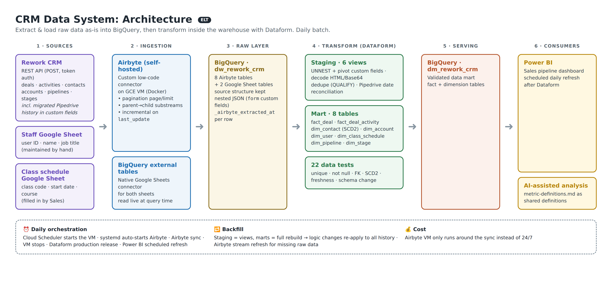
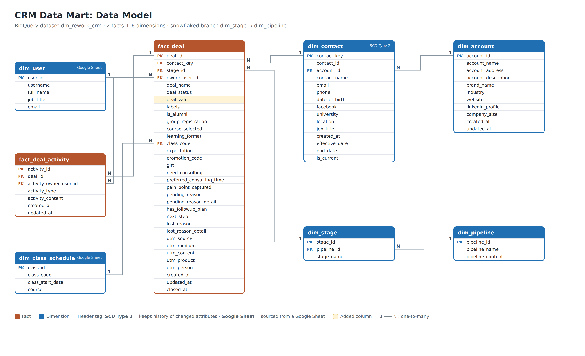

# CRM Data System: From Scattered CRM Data to a Trusted Sales Dashboard

> An end-to-end data system (**Airbyte → BigQuery → Dataform → Power BI**) built on real company data after a CRM migration (Pipedrive → Rework CRM). It covers API ingestion, historical reconciliation, dimensional modeling, data-quality validation, and one shared set of metric definitions.



---

## The problem

The company migrated its CRM from **Pipedrive to Rework CRM**. After that:

- The old reports still read from the Pipedrive database, which was no longer used, so **they stopped reflecting reality**.
- New reports built on Rework showed **wrong dates**: when historical data was imported into Rework, each record's real creation time was replaced with the **import time**.

**Goal:** one system that brings CRM data into one place, cleans it, keeps it up to date, and defines every metric once, while **preserving Pipedrive history**.

---

## Architecture decisions

| Decision | Choice | Why |
|---|---|---|
| **Warehouse** | **BigQuery** | Already used by the company. Google Sheets (staff list, class schedule) connect natively as external tables, and Dataform runs inside BigQuery |
| **ETL or ELT** | **ELT** | Raw CRM data (including nested JSON custom fields) is loaded as-is, and all transformation is done in SQL with Dataform. Because staging models are views and marts are rebuilt in full, a logic change is re-applied to all history without re-extracting |
| **Data Lake** | **Not needed** | All sources are structured tables. There are no files or unstructured data to store |
| **Data Mart** | **Yes** | Power BI reads clean fact and dimension tables instead of raw API data |
| **Schema** | Fact + dimension tables, with one snowflaked branch `dim_stage → dim_pipeline` | Each stage belongs to one pipeline, as in the CRM |
| **Ingestion tool** | **Airbyte (self-hosted)**, custom low-code connector | Built in the Airbyte Connector Builder to handle the Rework API's auth, pagination and parent-child endpoints |
| **Transformation** | **Dataform** | SQLX + Git, dependency graph via `ref()` and scheduling inside BigQuery |

---

## Sources & ingestion

| Source | Method |
|---|---|
| **Rework CRM API**: deals, activities, contacts, accounts, pipelines, stages, services (8 streams) | Custom Airbyte connector ([YAML](ingestion/airbyte/rework-crm-connector.yaml)). `deal` and `contact` sync incrementally on `last_update`; the other streams are full refresh |
| **Staff Google Sheet**: user ID, name, job title (maintained by hand) | BigQuery external table `user`, modeled into `dim_user` |
| **Class schedule Google Sheet**: class ID, class code, start date, course (filled in by Sales) | BigQuery external table `course_schedule`, modeled into `dim_class_schedule` |

Duplicates: each staging model keeps only the latest version per ID (`QUALIFY ROW_NUMBER()`).
→ [ingestion/README](ingestion/README.md)

---

## Data model



| Table | Grain | Notes |
|---|---|---|
| `fact_deal` | 1 row per deal | Status, stage, owner, **deal value (revenue)**, course, attribution (UTM), Pipedrive-reconciled dates |
| `fact_deal_activity` | 1 row per activity | Notes, system changelog (stage/pipeline moves, contact changes), activity logs, files |
| `dim_contact` | 1 row per contact **version** | **SCD Type 2** on `job_title`, `location`. Deals join the version valid at deal creation |
| `dim_account`, `dim_user`, `dim_pipeline`, `dim_stage` | 1 row per entity | `dim_user` comes from the staff Google Sheet |
| `dim_class_schedule` | 1 row per class | Class code, start date, course, from the class-schedule Google Sheet |

→ [Data Dictionary](docs/data-dictionary.md) (columns) · [Metric Definitions](docs/metric-definitions.md) (metrics)

---

## Transformation & data quality

Dataform builds **6 staging views → 8 mart tables**.

Before the dashboard was built, a [Data Quality Review](docs/data-quality-review.pdf) was run on the mart. For example, it found a 99.97% orphan rate on `dim_contact.account_id`. Part of this is the business rule `account_id = 0` = contact without a company; the remaining orphans are still being investigated. The dashboard was also [reconciled](docs/testing-validation.md) against the previous Pipedrive-based dashboard and against Rework CRM.
→ [transform/README](transform/README.md)

---

## Orchestration

Runs **daily at 12:00**: VM start → Airbyte sync → VM stop → Dataform production run → **Power BI scheduled refresh** (after Dataform finishes).
→ [orchestration/README](orchestration/README.md)

---

## Case study in numbers

| | |
|---|---|
| Sources | **3** (Rework CRM API with 8 streams, staff Google Sheet, class-schedule Google Sheet) |
| Tables | **10** raw (8 Airbyte + 2 Google Sheets) → **6** staging views → **8** mart tables |
| Volume | ~**25.6k** deals · ~**54k** activities · ~**26.7k** contacts (history since 2021, incl. migrated Pipedrive data) |
| Refresh frequency | **Daily at 12:00** (Airbyte → Dataform → Power BI) |
| Data latency | *to be measured* |
| Monthly cost | *to be measured* |

---

## Repository structure

```text
crm-data-warehouse/
├── ingestion/                  # Airbyte connector (Rework API) + Google Sheet source
├── transform/                  # Dataform: staging and mart models
├── orchestration/              # how the daily schedule is set up
├── demo/                       # fake-data generator for a shareable Power BI demo
└── docs/
    ├── architecture.png        # data flow source → BI
    ├── data-model.png          # ERD
    ├── metric-definitions.md   # metric formulas, sources, users, pitfalls
    ├── data-dictionary.md      # column definitions
    ├── data-quality-review.pdf
    └── testing-validation.md   # dashboard reconciliation
```

## Data privacy

The problem and the system are real: this pipeline runs on the company's CRM data every day. **The data in this repository is not.**

- All data rows in this repo are **randomly generated demo data** ([`demo/`](demo/)), with the same tables, columns and labels as the real mart.
- No customer records, credentials (connector values are placeholders), GCP project ID or revenue values.
