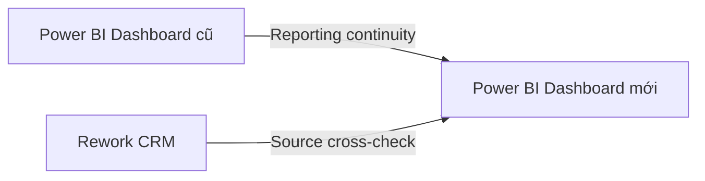

[English](README.md)

# Xây dựng lại hệ thống dữ liệu CRM khi chuyển từ Pipedrive sang Rework CRM

## Bối cảnh

Công ty chuyển CRM từ **Pipedrive sang Rework CRM**. Tuy nhiên, hai hệ thống có cấu trúc dữ liệu và API khác nhau.

**Vấn đề:** Data Warehouse cũ được xây dựng theo cấu trúc của Pipedrive nên data pipeline không còn hoạt động sau khi chuyển đổi. Trong khi đó, Sales Manager và Sales Admin vẫn cần theo dõi hiệu quả của team thông qua các chỉ số như **deal stage, win rate, lost reason và Sales activity**.

**Mục tiêu:** Xây dựng lại ingestion pipeline và data model theo cấu trúc của Rework CRM, đồng thời giữ lại dữ liệu lịch sử đã migrate từ Pipedrive để việc theo dõi Sales performance không bị gián đoạn.

---

## Architecture

```text
Rework CRM API
      │
      ▼
Airbyte (self-hosted)
Raw Ingestion + Incremental Sync
      │
      ▼
BigQuery
Raw Layer
      │
      ▼
Dataform
Staging + Transformation
      │
      ▼
BigQuery Data Mart
Fact + Dimension
      │
      ▼
Power BI
Sales Monitoring
```

| Layer | Tool | Chi tiết |
|---|---|---|
| Data Ingestion | Airbyte | [View Connector](./airbyte-custom-connector/) |
| Data Warehouse | BigQuery | [View Raw Layer](./assets/bigquery-raw-layer.png) |
| Transformation & Modeling | Dataform | [View Models](./dataform/) |
| Analytics | Power BI | [View Dashboard](./sales_dashboard/) |

---

## Data Model

Data Mart được thiết kế theo **Snowflake Schema**, xoay quanh Deal và Deal Activity cùng các dimension phục vụ phân tích.


Các bảng chính:

- `fact_deal` — mỗi dòng tương ứng với một deal
- `fact_deal_activity` — mỗi dòng tương ứng với một activity của deal
- `dim_contact` — thông tin Contact và lịch sử thay đổi của một số thuộc tính theo SCD Type 2
- `dim_account` — thông tin Account/Company
- `dim_pipeline` — thông tin Sales Pipeline
- `dim_stage` — thông tin Sales Stage
- `dim_user` — thông tin Sales owner

---

## Project Documentation

| Tài liệu | Nội dung |
|---|---|
| [Project Requirements](./docs/project-requirements.md) | Bối cảnh, reporting requirements, scope và execution plan |
| [Data Dictionary](./docs/data-dictionary.md) | Data model, grain và business meaning của các field |
| [Testing & Validation](./docs/testing-validation.md) | Cách đối soát dashboard, CRM và dữ liệu lịch sử |

---

# Cách triển khai

## 1. Tìm hiểu dữ liệu & quá trình migration

Trước khi xây dựng lại pipeline, tôi rà soát cấu trúc dữ liệu của hai hệ thống và cách dữ liệu lịch sử đã được migrate từ Pipedrive sang Rework CRM.

Trước đó, dữ liệu Pipedrive đã được export, mapping từng field tương ứng và import thủ công vào Rework.

Không phải field nào cũng có thể mapping trực tiếp. Một số giá trị gốc từ Pipedrive được lưu trong custom field của Rework, trong khi một số standard field của Rework lại phản ánh **thời điểm migration** thay vì thời điểm business event thực sự xảy ra.

Việc hiểu rõ mapping này là cơ sở để xác định field nào cần được sử dụng ở transformation layer.

→ [Xem Project Requirements](./docs/project-requirements.md)

---

## 2. Tìm hiểu & test API

Tôi đọc [Rework CRM API Documentation](https://rework-standard.apidocs.rework.site/home) và test các API chính bằng **Postman** trước khi xây dựng ingestion pipeline.

Quá trình test tập trung vào:

- Authentication
- Request và response structure
- Pagination
- Nested data
- Relationship giữa các endpoint

Các entity chính bao gồm **Deal, Contact, Account, Pipeline, Stage và Deal Activity**.

Bước này giúp xác định cách lấy dữ liệu của từng entity và cách thiết lập các stream tương ứng trên Airbyte.

---

## 3. Xây dựng ingestion pipeline với Airbyte

Sử dụng **Airbyte self-hosted** và Low-code Connector Builder để đưa dữ liệu từ Rework CRM API vào BigQuery.

Một số phần cần custom configuration:

### Authentication

API truyền credentials qua **request body** thay vì header.

### Pagination

API sử dụng `page / limit` pagination nên cần config thủ công trong connector.

### Parent-Child Stream

Deal Activity không có endpoint hỗ trợ bulk fetching.

Vì vậy pipeline lấy danh sách Deal trước, sau đó sử dụng từng Deal ID để lấy Activity tương ứng:

```text
Deals → Deal IDs → Activities for each Deal
```

### Incremental Sync

Với khoảng **25.000 deals và 25.000 contacts**, reload toàn bộ dữ liệu ở mỗi lần chạy là không cần thiết.

Incremental Sync được thiết lập để mỗi lần chạy chỉ lấy các record mới hoặc đã thay đổi.

→ [Xem Airbyte Connector](./airbyte-custom-connector/)

---

## 4. Lưu Raw Data trên BigQuery

Dữ liệu từ Airbyte được load vào **BigQuery raw layer** trước khi áp dụng business transformation.

Raw layer giữ lại cấu trúc dữ liệu từ source, bao gồm nested JSON, dynamic custom fields và các phiên bản record được ingest qua Airbyte.

Việc tách raw layer khỏi transformation layer cũng giúp dễ trace dữ liệu ngược về source khi cần kiểm tra hoặc xử lý sai lệch.


---

## 5. Làm sạch & transform dữ liệu với Dataform

Sau khi raw data được ingest vào BigQuery, **Dataform** được sử dụng để xây dựng staging layer và chuyển dữ liệu CRM thành dạng sẵn sàng cho phân tích.

Dataform project được tổ chức theo:

`declarations → staging → marts`

### Nested JSON & Custom Fields

Rework lưu nhiều custom field dưới dạng dynamic JSON array.

Các field này được `UNNEST`, sau đó pivot thành analytical columns bằng `MAX(IF(...))`.

```text
JSON Array → UNNEST → Key / Value → Pivot → Analytical Columns
```

Các transformation khác bao gồm:

- Parse nested JSON như `address`, `form`, `owners`
- Decode các giá trị HTML và Base64
- Standardize CRM status
- Mapping lost reason sang category dễ đọc
- Loại bỏ duplicate bằng `QUALIFY ROW_NUMBER()`

### Đối soát dữ liệu lịch sử từ Pipedrive

Các record được migrate cần xử lý thêm vì một số field trên Rework không còn phản ánh business event gốc.

Ví dụ, `created_at` trên Rework có thể là **ngày record được import**, thay vì ngày deal thực sự được tạo trên Pipedrive.

Transformation vì vậy ưu tiên giá trị lịch sử từ Pipedrive khi tồn tại:

```sql
COALESCE(
    pipedrive_created_at,
    rework_created_at
)
```

Logic tương tự được áp dụng cho các historical field khác khi cần, bao gồm close date và lost reason.

Nhờ đó, CRM migration không làm sai lệch dữ liệu Sales trong quá khứ.

→ [Xem Dataform Models](./dataform/)

---

## 6. Xây dựng Data Mart

Từ staging layer đã được làm sạch và chuẩn hóa, dữ liệu được transform thành các fact và dimension table phục vụ phân tích.

Data Mart sử dụng **Snowflake Schema**.

Một vấn đề cần xử lý là các thuộc tính của Contact như **Job Title và Location có thể thay đổi theo thời gian**.

Vì vậy, `dim_contact` sử dụng **Slowly Changing Dimension Type 2 (SCD2)** để lưu lại các phiên bản lịch sử.

Nhờ đó, một deal trong quá khứ có thể được phân tích theo thông tin Contact tại thời điểm deal được tạo, thay vì luôn sử dụng thông tin hiện tại.

→ [Xem Data Dictionary](./docs/data-dictionary.md)

---

## 7. Reporting với Power BI

Data Mart được sử dụng làm data source cho **Power BI Sales Dashboard**.

Sales thường làm việc trực tiếp trên Rework CRM để quản lý từng deal. Power BI chủ yếu phục vụ **Sales Manager và Sales Admin** để theo dõi performance ở cấp độ toàn team.

Dashboard hỗ trợ theo dõi:

- Sales pipeline
- Deal stage
- Win / loss performance
- Lost reason
- Sales activity
- Team performance
- Các warning signal cần chú ý

→ [Xem Dashboard](./sales_dashboard/)

---

## Testing & Validation

Dashboard mới được đối soát theo hai hướng:



### Dashboard cũ vs. Dashboard mới

Áp dụng cùng reporting period và filter trên hai dashboard để kiểm tra các chỉ số chính như **deal count, deal stage, won/lost deals, win rate, lost reason và team performance** có còn nhất quán sau khi migrate CRM hay không.

### Rework CRM vs. Dashboard mới

Với dữ liệu hiện tại, áp dụng các filter tương ứng trực tiếp trên Rework CRM và Power BI để kiểm tra kết quả dashboard có phản ánh đúng operational data hay không.

Các record lịch sử cũng được kiểm tra riêng trong những trường hợp timestamp của Rework có thể phản ánh migration date thay vì business date gốc.

→ [Xem chi tiết Testing & Validation](./docs/testing-validation.md)

---

## Kỹ năng & Công cụ

| Area | Skills & Tools |
|---|---|
| **API** | REST API, Postman, pagination, parent-child stream |
| **Data Ingestion** | Airbyte, Low-code Connector Builder, Incremental Sync |
| **Data Warehouse** | BigQuery |
| **SQL** | `JSON_VALUE`, `UNNEST`, `QUALIFY ROW_NUMBER()`, Window Functions |
| **Transformation** | Dataform, Staging & Mart |
| **Data Modeling** | Snowflake Schema, Fact & Dimension, SCD Type 2, Surrogate Key |
| **BI** | Power BI, Sales Pipeline Reporting |

---

## Kết quả

Pipeline mới đã khôi phục data flow từ **Rework CRM → Data Warehouse → Power BI** sau khi công ty chuyển đổi CRM.

Dữ liệu lịch sử từ Pipedrive được giữ lại và xử lý để các khác biệt do migration không làm sai lệch historical reporting.

Nhờ đó, **Sales Manager và Sales Admin có thể tiếp tục theo dõi performance của team, tình trạng Sales Pipeline và các warning signal trên Power BI**, trong khi Sales tiếp tục sử dụng Rework CRM cho hoạt động hằng ngày.

---

## Repository Structure

```text
crm-data-warehouse/
│
├── docs/
│   ├── project-requirements.md   # Requirements, scope & execution plan
│   ├── data-dictionary.md        # Data model & field definitions
│   └── testing-validation.md     # Data & reporting validation
│
├── airbyte-custom-connector/     # Rework CRM API ingestion
├── dataform/                     # Transformation & Data Mart
├── sales_dashboard/              # Power BI dashboard
└── assets/                       # ERD & supporting screenshots
```

---

## Dashboard Preview


---

> **Note:** Dự án này được xây dựng dựa trên dữ liệu thực tế của doanh nghiệp. Để đảm bảo tính bảo mật, các thông tin nhạy cảm trên dashboard đã được làm mờ hoặc ẩn; các key, credentials và giá trị bảo mật cũng đã được loại bỏ khỏi code và các file được chia sẻ trong repository.
