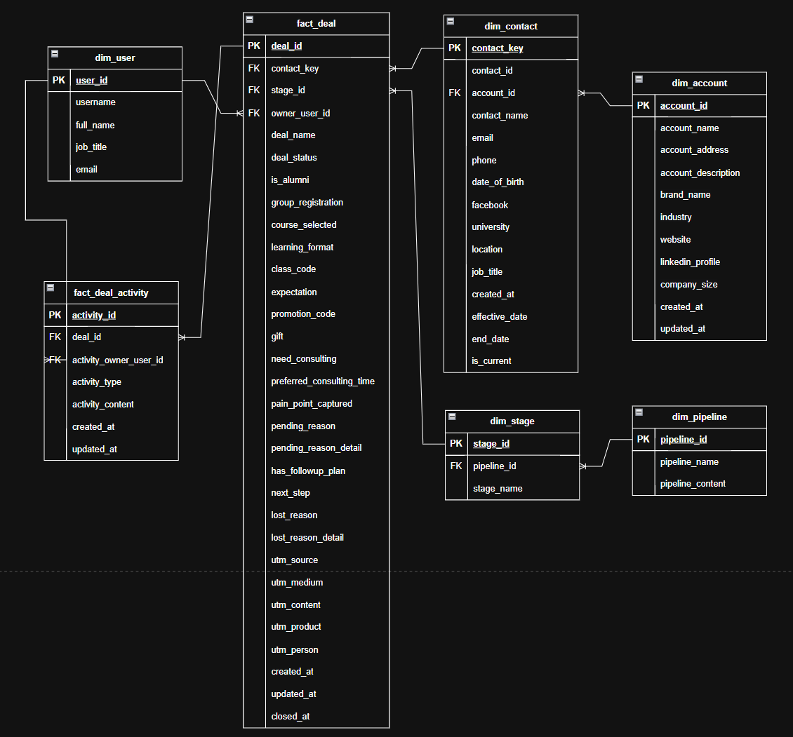

# Data Dictionary

## Data Model

---

## `fact_deal`

**Grain:** One row per deal

| Field | Definition |
|---|---|
| `deal_id` | Unique identifier of the deal |
| `contact_key` | Contact version associated with the deal |
| `stage_id` | Current Sales stage |
| `owner_user_id` | Sales owner responsible for the deal |
| `deal_name` | Name of the deal |
| `deal_status` | Deal status: Open, Won, or Lost |
| `course_selected` | Course/product selected by the customer |
| `learning_format` | Selected learning format |
| `pain_point_captured` | Whether the customer's pain point has been identified |
| `pending_reason` | Reason why the deal is pending |
| `next_step` | Next planned Sales action |
| `lost_reason` | Standardized reason why the deal was lost |
| `lost_reason_detail` | Additional detail about the lost reason |
| `utm_source` | Marketing acquisition source |
| `utm_medium` | Marketing acquisition medium |
| `utm_content` | Campaign/content attribution |
| `created_at` | Original deal creation date |
| `updated_at` | Last update date |
| `closed_at` | Deal close date |

> For migrated records, historical Pipedrive dates are used when the
> corresponding Rework timestamps represent the migration event.

---

## `fact_deal_activity`

**Grain:** One row per deal activity

| Field | Definition |
|---|---|
| `activity_id` | Unique identifier of the activity |
| `deal_id` | Deal associated with the activity |
| `activity_type` | Activity type, such as Call, Note, or Change Log |
| `activity_content` | Activity content or description |
| `owner_user_id` | User associated with the activity |
| `created_at` | Activity creation time |

---

## `dim_contact`

**Grain:** One row per Contact version (SCD Type 2)

| Field | Definition |
|---|---|
| `contact_key` | Surrogate key for a Contact version |
| `contact_id` | CRM Contact identifier |
| `account_id` | Account associated with the Contact |
| `contact_name` | Contact name |
| `location` | Contact location |
| `job_title` | Contact job title |
| `created_at` | Original Contact creation date |
| `effective_date` | Date the version became effective |
| `end_date` | Date the version stopped being effective |
| `is_current` | Whether this is the current Contact version |

> SCD Type 2 is used to preserve changes in `job_title` and `location`.

---

## `dim_account`

**Grain:** One row per account

| Field | Definition |
|---|---|
| `account_id` | Unique Account identifier |
| `account_name` | Company/account name |
| `industry` | Company industry |
| `company_size` | Company size |
| `website` | Company website |

---

## `dim_pipeline`

| Field | Definition |
|---|---|
| `pipeline_id` | Unique Pipeline identifier |
| `pipeline_name` | Pipeline name |

---

## `dim_stage`

| Field | Definition |
|---|---|
| `stage_id` | Unique Stage identifier |
| `pipeline_id` | Pipeline containing the Stage |
| `stage_name` | Stage name |

---

## `dim_user`

| Field | Definition |
|---|---|
| `user_id` | Internal user identifier |
| `full_name` | Employee name |
| `job_title` | Employee job title |
