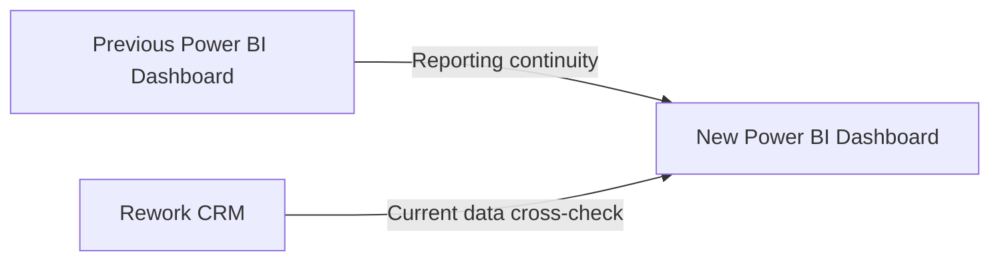

# Testing & Validation

## Validation Approach

The rebuilt dashboard was validated from two directions:



These checks were designed to validate both **historical reporting continuity** and **current CRM accuracy**.

---

## 1. Previous Power BI Reconciliation

The previous Power BI dashboard was used as the reference for historical reporting continuity after the migration from Pipedrive to Rework CRM.

The same reporting periods and filters were applied to both dashboards.

Key metrics compared:

- Deal count
- Deal stage
- Won / Lost deals
- Win rate
- Lost reasons
- Team performance

```text
Same Period + Same Filters
          ↓
Previous Power BI
          ↕
     New Power BI
```

When differences were identified, the underlying Data Mart and transformation logic were traced to determine whether the difference came from the CRM migration, historical date handling, or transformation logic.

For migrated records, particular attention was given to cases where Rework timestamps represented the **migration date rather than the original business date**. Historical Pipedrive values were therefore checked to ensure that the original business event was preserved where available.

---

## 2. Rework CRM Cross-check

The new Power BI dashboard was also checked against the current Rework CRM to verify that the reporting layer reflected the operational CRM correctly.

Equivalent filters and conditions were applied in both systems.

For example:

```text
Pipeline + Stage + Period
          ↓
Rework CRM
     ↕
New Power BI
```

Key metrics compared:

- Deal count
- Deal stage
- Won / Lost deals
- Win rate
- Lost reasons
- Team performance

This check validates the **current-state reporting accuracy** of the dashboard.

---

## Validation Summary

The two checks answer two different questions:

| Validation | Question |
|---|---|
| **Previous Power BI → New Power BI** | Did the CRM migration preserve historical reporting continuity? |
| **Rework CRM → New Power BI** | Does the new dashboard accurately reflect the current CRM? |

Together, these checks validate both **historical continuity** and **current reporting accuracy**.
