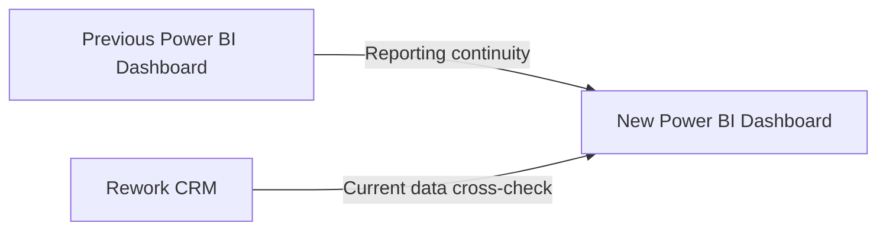

# Testing & Validation

## Validation Approach

The rebuilt dashboard was validated from two directions:

- **Previous Dashboard → New Dashboard:** check whether key Sales metrics remained consistent after the CRM migration.
- **Rework CRM → New Dashboard:** check whether current dashboard results matched the operational CRM.

---

## 1. Previous Dashboard Reconciliation

The same reporting periods and filters were applied to both dashboards.

Key metrics checked included:

- Deal count
- Deal stage
- Won / Lost deals
- Win rate
- Lost reasons
- Team performance

For example:

`Same period + Same filters → Old Dashboard vs. New Dashboard`

Any unexpected difference was traced back through the Data Mart, staging layer, and source data.

---

## 2. Rework CRM Cross-check

For current data, the same conditions were applied directly in Rework CRM and Power BI.

For example:

`Pipeline + Stage + Period → CRM result vs. Power BI result`

This helped verify that the dashboard reflected the operational CRM correctly.

---

## 3. Historical Data Check

Migrated records required an additional check because some Rework timestamps represented the **migration date**, not the original business date.

For migrated records, the final dashboard was checked to ensure that the original Pipedrive value was preserved when available.
